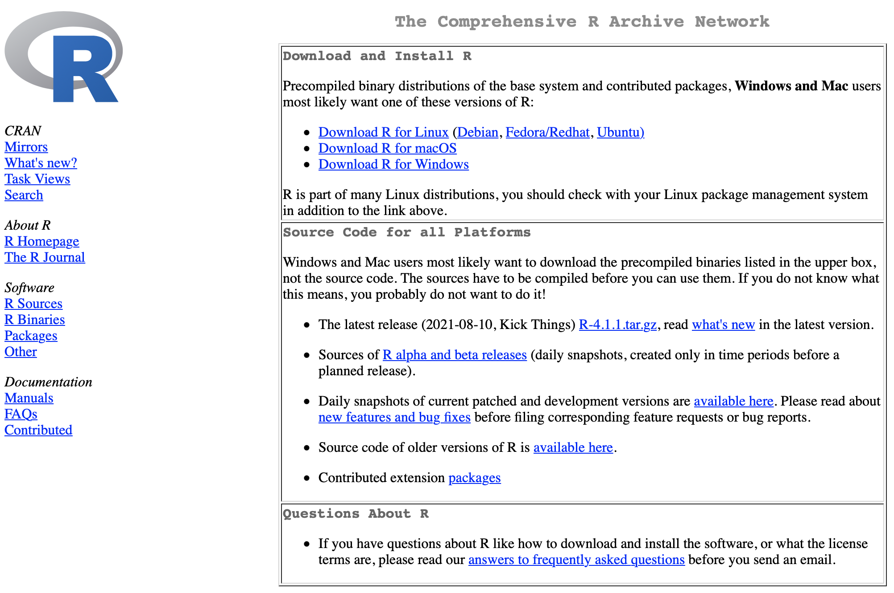

class: chapter-slide
# El entorno de RStudio

<br><br><br><br><br>
```{r,echo=FALSE,out.width='30%',fig.align='right'}
knitr::include_graphics("https://raw.githubusercontent.com/rstudio/hex-stickers/master/PNG/RStudio.png")
```


---
# Instalación

```{r,echo=FALSE,out.width='70%',fig.align='center'}
knitr::include_graphics("img/download.png")
```
.center[<https://www.rstudio.com/products/rstudio/download/>]

---
# Abriendo RStudio

```{r,echo=FALSE,out.width='70%',fig.align='center'}
knitr::include_graphics("img/RStudio.png")
```

---
# El panel Console

Es el lugar donde ejecutamos código directamente.

```{r,echo=FALSE,out.width='60%',fig.align='center'}

```

---
# El panel de Scripts

Es nuestro 'bloc de notas' donde podemos guardar código, hacer comentarios y ejecutar el código hacia la consola.

```{r,echo=FALSE,out.width='70%',fig.align='center'}

```

---
# La pestaña Environment

Muestra las variables y las funciones que hemos creado y ejecutado durante nuestra sesión.

```{r,echo=FALSE,out.width='70%',fig.align='center'}

```

---
# La pestaña History

Muestra el historial del código que hemos ejecutado. 

```{r,echo=FALSE,out.width='70%',fig.align='center'}

```

---
# La pestaña Files

Muestra los archivos en nuestra computadora, localizados en nuestro directorio de trabajo.

```{r,echo=FALSE,out.width='70%',fig.align='center'}
knitr::include_graphics("img/files.png")
```

---
# La pestaña Plots

Nos muestra las gráficas, resultado de la ejecución de funciones para generar gráficas desde R base o con ayuda de ggplot2.

```{r,echo=FALSE,out.width='50%',fig.align='center'}
knitr::include_graphics("img/plots.png")
```

---
# La pestaña Packages

Nos muestra los paquetes que tenemos instalados en nuestra computadora.

```{r,echo=FALSE,out.width='68%',fig.align='center'}
knitr::include_graphics("img/packages.png")
```

---
# La pestaña Help

Nos muestra la documentación de una función; incluye su descripción, funcionamiento, argumentos/parámetros, el tipo de resultados y ejemplos.

```{r,echo=FALSE,out.width='50%',fig.align='center'}
knitr::include_graphics("img/help.png")
```

---
# La pestaña Viewer

Nos muestra una vista previa de los archivos tipo .Rmd, que generalmente visualizamos como html.

```{r,echo=FALSE,out.width='55%',fig.align='center'}

```

---
# Creando otros archivos del entorno de R

.pull-left[<br><br><br>
Podemos crear diversos archivos dentro de R, como .R, .Rmd, .css, .txt, .html, etc.

Estos archivos los podremos editar en el mismo espacio del panel de scripts.
]

.pull-right[
```{r,echo=FALSE,out.width='75%',fig.align='center'}
knitr::include_graphics("img/new_file.png")
```
]

---
class: chapter-slide

# Algunas configuraciones de RStudio

---
# El archivo .RData

.pull-left[<br><br><br>
Este archivo guarda todas las variables de nuestro Environment y los paquetes cargados durante la sesión.

En general no es recomendable guardarlo, es preferible comenzar desde un entorno limpio.

]

.pull-right[
```{r,echo=FALSE,out.width='93%',fig.align='center'}
knitr::include_graphics("img/RData.png")
```
]

---
# Paréntesis de arcoíris

.pull-left[<br><br><br>
Nos facilita diferenciar en dónde se abren y cierran los paréntesis.

Es especialmente útil cuando trabajamos con código anidado.
]

.pull-right[
```{r,echo=FALSE,out.width='93%',fig.align='center'}

```
]


---
# Apariencia del entorno de RStudio

.pull-left[<br><br><br>
Podemos elegir la mejor combinación de colores para mejorar el contraste.

El mejor contraste puede depender de la situación en la que mostremos nuestro código.

]

.pull-right[
```{r,echo=FALSE,out.width='92%',fig.align='center'}
knitr::include_graphics("img/appearance.png")
```
]

---
class: chapter-slide

# Algunos atajos del teclado

---
# Atajos para trabajar con scripts
<br>

.pull-left[
- Abrir un nuevo script 
    - Shift + Command + N 
    - Shift + Ctrl + N
    
- Guardar los cambios del script 
    - Command + S 
    - Ctrl + S
]

--
.pull-right[
- Ejecutar el código del script 
    - Command + Enter 
    - Ctrl + Enter

- Escribir el símbolo de asignación 
    - option + - 
]

---
# Todos los atajos disponibles

.pull-left[<br><br><br>
La combinación de teclas depende del sistema operativo de nuestra computadora.

RStudio detecta el sistema que estamos usando y nos muestra la combinación para nuestro caso.

]

.pull-right[
```{r,echo=FALSE,out.width='65%',fig.align='center'}

```
]

---
class: chapter-slide
# Mantenimiento de nuestro entorno

---
# Actualizaciones de R y RStudio

.pull-left[
- R desde CRAN

```{r,echo=FALSE,out.width='100%',fig.align='center'}

```
.center[<https://cran.r-project.org>]
]

.pull-right[
- RStudio desde la aplicación

```{r,echo=FALSE,out.width='70%',fig.align='center'}

```
]


---

.pull-left[<br><br><br><br><br><br><br>
.center[
# ¡Gracias!
]
]

.pull-right[
```{r,echo=FALSE,out.width='90%',fig.align='center'}
knitr::include_graphics("img/Xolbio1.png")
```
]
